# Altium Library

### Thuận lợi

- **Quản lý linh kiện tập trung:** thông tin linh kiện được lưu trong PostgreSQL, bao gồm Part Number, mô tả, nhà sản xuất, thông số, liên kết nhà cung cấp và các tham chiếu đến Symbol/Footprint.
- **Tích hợp trực tiếp với Altium Designer:** Altium truy cập cơ sở dữ liệu thông qua file `.DbLib`, trình điều khiển `psqlODBC` và `System DSN`, giúp tìm và sử dụng linh kiện ngay trong bảng `Components`.
- **Tách dữ liệu và thư viện rõ ràng:** PostgreSQL quản lý metadata của linh kiện, trong khi repository lưu các thư viện `SchLib`, `PcbLib` và model 3D `STEP`. Cách tổ chức này giúp dễ quản lý, sao lưu và mở rộng thư viện.
- **Đồng bộ Symbol, Footprint và model 3D:** mỗi linh kiện trong database có thể tham chiếu đến Symbol, Footprint và STEP tương ứng, giúp hạn chế chọn nhầm package hoặc model khi thiết kế PCB.
- **Dễ cập nhật và mở rộng:** dữ liệu có thể được bổ sung/cập nhật bằng công cụ migration mà không cần tạo lại toàn bộ thư viện từ đầu.
- **Phù hợp cho làm việc nhiều máy hoặc theo nhóm:** khi PostgreSQL được đặt trên một máy chủ dùng chung, nhiều máy Altium có thể dùng cùng một nguồn dữ liệu sau khi cấu hình DSN và đường dẫn thư viện thống nhất.

### Cách thức hoạt động

Thư viện sử dụng mô hình **Database Library (DbLib)** của Altium Designer. Luồng hoạt động chính như sau:

1. **PostgreSQL** lưu metadata của linh kiện như Part Number, Description, Manufacturer, thông số kỹ thuật, `Library Ref`, `Library Path`, `Footprint Ref` và `Footprint Path`.
2. **psqlODBC** tạo cầu nối giữa Windows và PostgreSQL. Một `System DSN` (ví dụ `localPostgres`) chứa thông tin kết nối đến database.
3. File **`Postgres Altium Library - altium_library.DbLib`** sử dụng DSN để kết nối Altium Designer với PostgreSQL.
4. Khi người dùng tìm/chọn một linh kiện trong Altium, `.DbLib` truy vấn database để lấy thông tin linh kiện và các tham chiếu đến thư viện.
5. Altium nạp **Symbol** từ thư mục `symbols`, **Footprint** từ thư mục `footprints`; model 3D **STEP** được liên kết với Footprint tương ứng để hiển thị mô hình 3D của linh kiện.
6. Công cụ **`altium-migrator`** được dùng để tạo hoặc cập nhật dữ liệu PostgreSQL từ bộ thư viện, giúp database và các file thư viện duy trì cùng cấu trúc tham chiếu.

Luồng kết nối có thể hình dung ngắn gọn:

`PostgreSQL → psqlODBC / System DSN → .DbLib → Altium Designer → Symbol / Footprint / STEP`

<p align="center">
  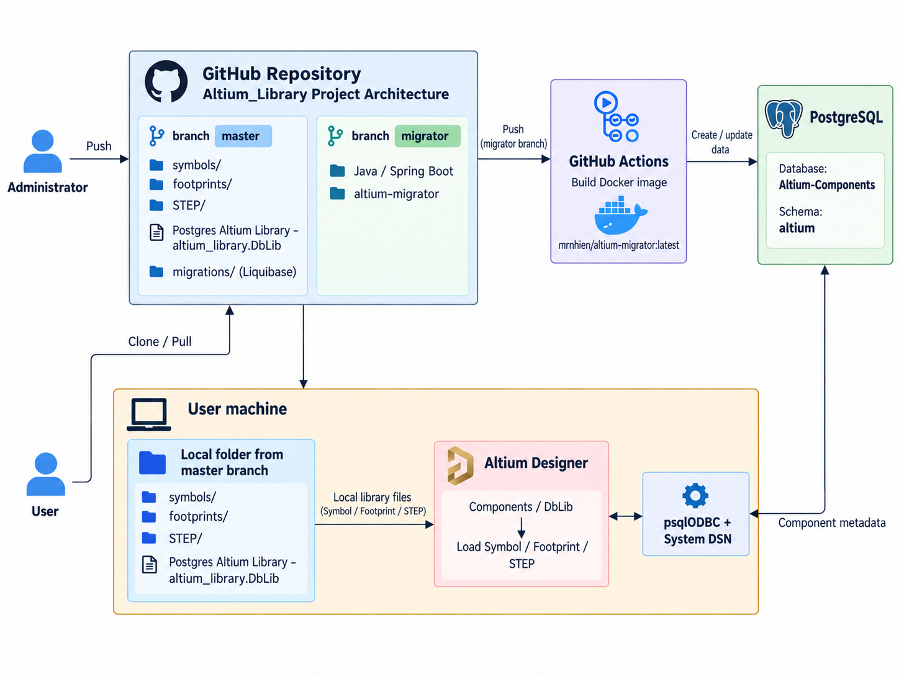
</p>

### Cách sử dụng

#### Clone repository

```
https://github.com/NguyenHien-8/Altium_Library.git
```

### Cấu hình trình điều khiển ODBC cho PostgreSQL

#### Offline development configuration
1. Tải xuống và cài đặt Postgres để phát triển cục bộ [here](https://www.enterprisedb.com/downloads/postgres-postgresql-downloads) -> `Download the installer`.
  - Tải xuống và cài đặt công cụ PgAdmin từ [here](https://www.pgadmin.org/).
  - Tạo cơ sở dữ liệu trống:
    <p align="center">
      
    </p>
  - Trong `Database` ô này, hãy viết: `Altium-Components` -> `Save`
    <p align="center">
      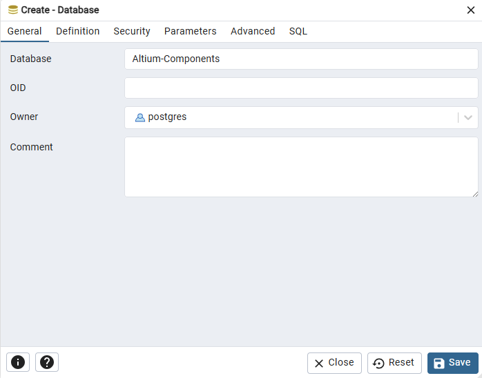
    </p>
2. Tải xuống trình điều khiển pSQLODBC_x64 từ [this](https://www.postgresql.org/ftp/odbc/versions.old/) vị trí.
  Chúng ta đang cấu hình trình điều khiển ODBC cho Windows 11 trở lên, vì vậy chúng ta sẽ tải xuống tệp MSI của trình điều khiển. Nhấp vào thư mục MSI.
    <p align="center">
      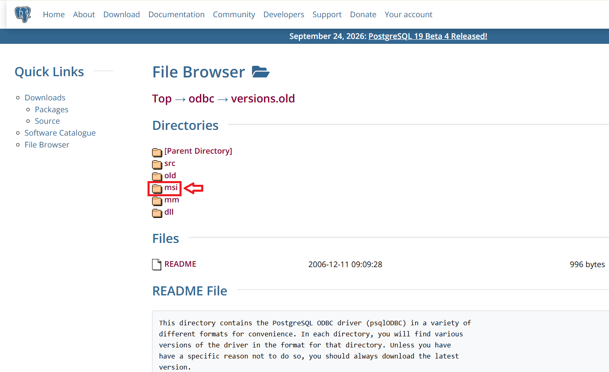
    </p>
3. Trong thư mục MSI, bạn có thể xem các phiên bản trình điều khiển khác nhau. Các tệp được nén ở định dạng zip.
      Chúng ta muốn tải xuống phiên bản mới nhất, vì vậy hãy cuộn xuống cuối trang và nhấp vào tệp `psqlodbc_13_02_0000-x86-1.zip`.
    <p align="center">
      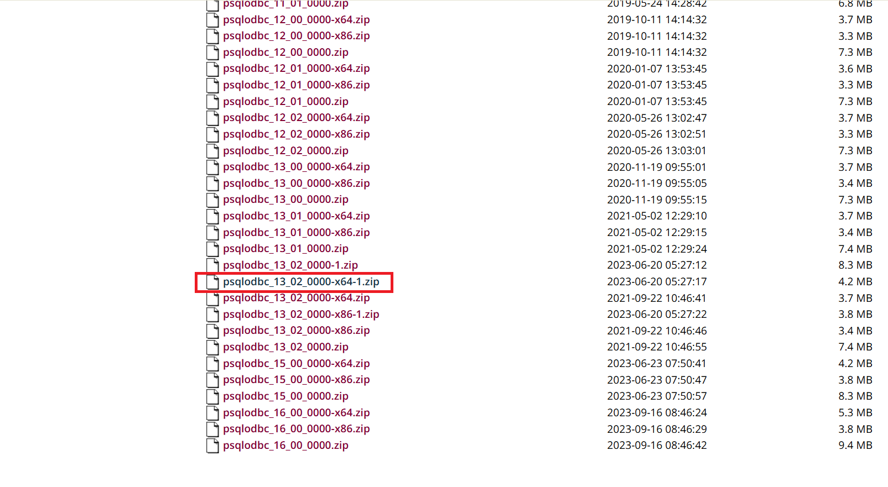
    </p>
4. Sau khi quá trình tải xuống hoàn tất, nhấp chuột phải vào tệp `psqlodbc_13_02_0000-x86-1.zip` và chọn Extract to `psqlodbc_13_02_0000-x86-1.zip`.
    <p align="center">
      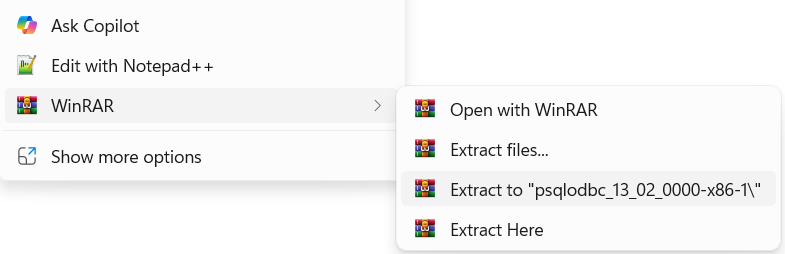
    </p>
5. Cài đặt trình điều khiển psqlODBC_x64. Nhấp vào `Next`.
    <p align="center">
      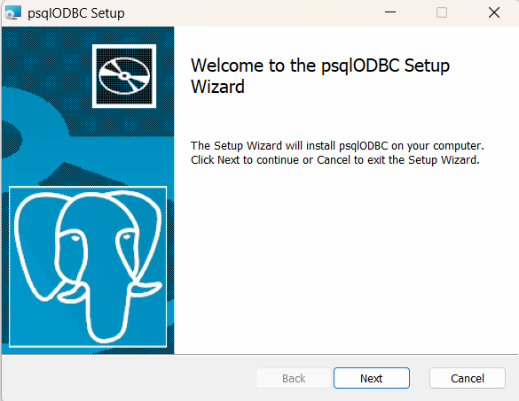
    </p>
6. Sau đó nhấp vào "I accept the terms in the license agreement"
7. Trên màn hình ***Custom Setup***, Bạn có thể chọn tính năng của trình điều khiển. Nhấp chuột `Next`.
8. Trên màn hình ***Ready to install***, Nhấp chuột vào `Install`.

#### Cấu hình trình điều khiển pSQLODBC_x64 sử dụng System DSN
1. Nhấn `Window` và viết `ODBC`.
    <p align="center">
      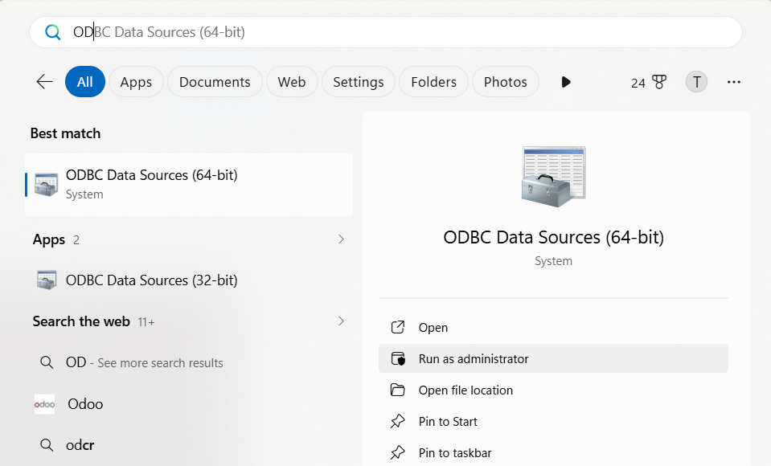
    </p>
2. Mở ODBC Data Source (64-bit) -> Nhấp vào thẻ System DSN -> Nhấp vào Add.
    <p align="center">
      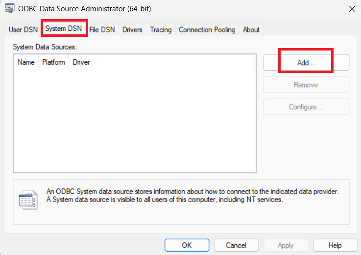
    </p>
3. Hộp thoại "Create a new data source" sẽ mở ra. Hãy chọn trình điều khiển PostgreSQL ODBC Driver(UNICODE) và nhấp vào nút Finish.
    <p align="center">
      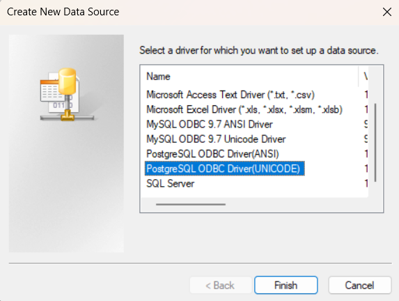
    </p>
4. Cấu hình các thông số như sau và nhấn `Test`.
    <p align="center">
      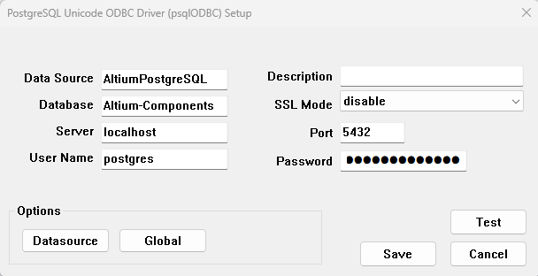
    </p>
5. Kiểm tra kết nối.
    <p align="center">
      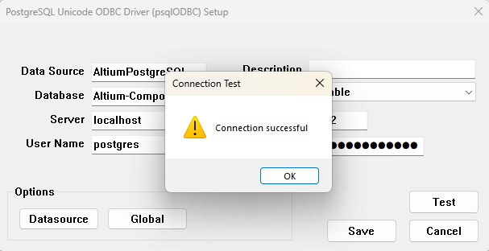
    </p>
6. Nhấp vào Lưu để tạo DSN hệ thống. Quay lại màn hình DSN hệ thống, bạn có thể thấy `localPostgres` DSN đã được tạo.
    <p align="center">
      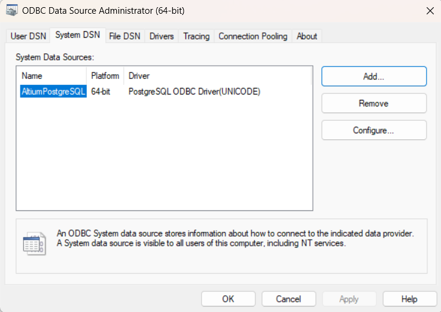
    </p>

#### Nạp dữ liệu vào cơ sở dữ liệu bằng công cụ migration
1. Đi đến [altium-migrator](https://github.com/ximtech/altium-migrator#how-to-use-it) và làm theo hướng dẫn.
2. Nếu mọi thứ đều ổn, hãy chuyển sang bước tiếp theo.

#### Thêm thư viện vào Altium
1. Mở `Altium designer` -> `Components` -> `File-based Libraries Preferences` -> `Install`
2. Đi đến thư mục `altium-library` rồi chọn:
    <p align="center">
      
    </p>
3. Ngoài ra, hãy kiểm tra các cài đặt kết nối bằng cách nhấn nút `Advanced...`
    <p align="center">
      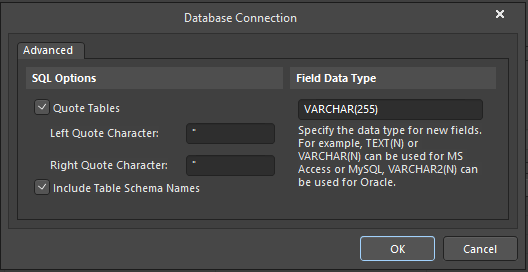
    </p>

## Đối với cơ sở dữ liệu đã tồn tại
1. Bỏ qua mẹo đầu tiên trong `Offline development configuration` hướng dẫn sử dụng.
2. Trong `Configure pSQLODBC_x64 Driver using System DSN` phần thiết lập các giá trị nguồn dữ liệu cơ sở dữ liệu của bạn (host, port, username and password)
3. Điền dữ liệu vào cơ sở dữ liệu bằng công cụ [altium-migrator](https://github.com/ximtech/altium-migrator)
4. Sau đó, `altium-library` mở thư mục `Postgres Altium Library - altium_library.DbLib` bằng Notepad và thay đổi `ConnectionString`dòng thứ 4 thành các tham số DB tùy chỉnh.
