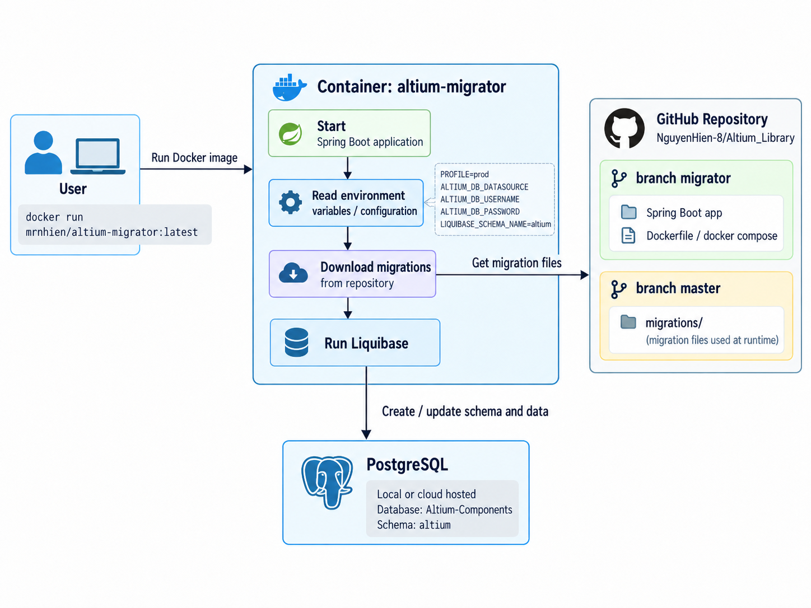
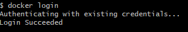
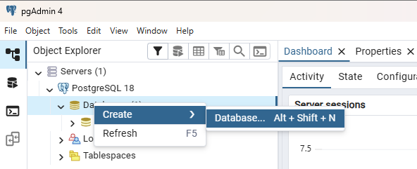
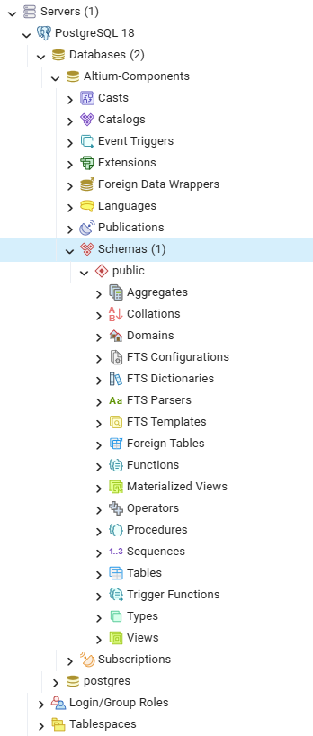
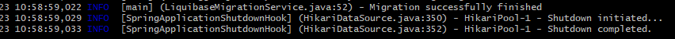
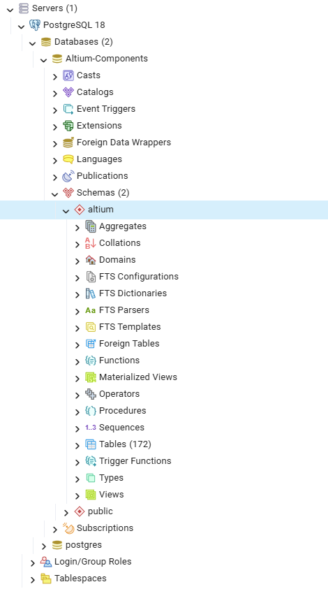

# Công cụ di chuyển cơ sở dữ liệu Altium

Công cụ di chuyển cơ sở dữ liệu Altium là một ứng dụng Spring Boot giúp xử lý các thay đổi từ
[kho linh kiện Git](https://github.com/NguyenHien-8/Altium_Library) sang cơ sở dữ liệu cục bộ để phát triển ngoại tuyến
hoặc sang bất kỳ cơ sở dữ liệu PostgreSQL được lưu trữ nào khác thông qua nguồn dữ liệu (data source).


### Cách thức hoạt động

<p align="center">
  
</p>

1. Người dùng chạy lệnh Docker. Nếu image của ứng dụng chưa có trong bộ nhớ cục bộ, Docker sẽ tự động tải image này từ Docker Hub công khai.
2. Container sẽ khởi động với thông tin kết nối cơ sở dữ liệu do người dùng cung cấp hoặc sử dụng cấu hình mặc định dành cho môi trường phát triển cục bộ.
3. Sau khi khởi động, ứng dụng sẽ lấy các script migration (SQL dump của cơ sở dữ liệu) từ repository.
4. Sau đó, công cụ migration Liquibase sẽ kiểm tra trạng thái hiện tại của cơ sở dữ liệu và cập nhật nếu cần.
5. Ứng dụng có thể được chạy lại nhiều lần khi cần; dữ liệu hiện có sẽ không bị ghi đè hoặc tạo trùng lặp.


### Cách sử dụng

1. Trước tiên, tải xuống và cài đặt Docker tại đây: [Tải Docker Desktop cho Windows](https://www.docker.com/products/docker-desktop/)
2. Sau khi cài đặt Docker, mở Command Prompt và kiểm tra bằng lệnh: `docker ps`
3. Tiếp theo, cần đăng ký/đăng nhập Docker Hub. Mở Docker Desktop rồi chọn `Sign in`:
4. Kiểm tra trạng thái đăng nhập bằng lệnh: `docker login`



5. Sau khi Docker đã được cấu hình, cần cài đặt PostgreSQL cho môi trường cục bộ.
    - ***Phương án 1.*** Chạy cơ sở dữ liệu trong container, xem hướng dẫn [this](https://hub.docker.com/_/postgres)
      - Chạy lệnh: `docker pull postgres` để tải image PostgreSQL mới nhất.
      - Chạy image cơ sở dữ liệu:
      ```
        docker run -d -p 5432:5432        --name dev-postgres         -e POSTGRES_PASSWORD=postgres         -e POSTGRES_USER=postgres         -e POSTGRES_DB=altium-components         postgres
      ```
    - ***Phương án 2.*** Tải xuống và cài đặt Postgres để phát triển cục bộ [here](https://www.enterprisedb.com/downloads/postgres-postgresql-downloads) -> `Download the installer`.
        - Tải xuống và cài đặt công cụ PgAdmin từ [here](https://www.pgadmin.org/).
        - Tạo một cơ sở dữ liệu trống:
          <p align="center">
            
          </p>
        - Trong `Database` ô này, hãy viết: `Altium-Components` -> `Save`
        - Kiểm tra để đảm bảo cơ sở dữ liệu trống đã được tạo:
          <p align="center">
            
          </p>

6. ***Tùy chọn:*** Tạo schema cho cơ sở dữ liệu. Nếu không tạo, schema `altium` sẽ được tạo mặc định và được sử dụng cho tất cả các lần migration.
7. Sau khi đã hoàn tất cấu hình và tạo cơ sở dữ liệu trống, chạy ứng dụng.

***Phát triển cục bộ***
```text
docker run -p 5432:5432 -e PROFILE=docker-dev ximtech/altium-migrator
```

***Cơ sở dữ liệu được lưu trữ tùy chỉnh***

***Lưu ý:*** Khi sử dụng nguồn dữ liệu tùy chỉnh, không thay đổi biến `PROFILE`.

```text
    docker run -p 5432:5432     -e PROFILE=prod     -e ALTIUM_DB_DATASOURCE='jdbc:postgresql://host.docker.internal:5432/altium-components'     -e ALTIUM_DB_USERNAME='postgres'     -e ALTIUM_DB_PASSWORD='postgres'     -e LIQUIBASE_SCHEMA_NAME=altium     ximtech/altium-migrator:latest
```

8. Cuối cùng, kiểm tra để đảm bảo toàn bộ dữ liệu đã được chuyển thành công:
- 

***Cấu trúc cơ sở dữ liệu***
- 
