# Altium Library

<p align="center">
  <b>Language / Ngôn ngữ:</b>
  <br>
  <a href="#english">🇬🇧 English</a> &nbsp;|&nbsp; <a href="#tiếng-việt">🇻🇳 Tiếng Việt</a>
</p>

---

<a id="english"></a>
## English

### Key Advantages

- **Centralized Component Management:** Component metadata is stored centrally in PostgreSQL, including Part Numbers, descriptions, manufacturers, technical specifications, supplier links, and references to Symbols/Footprints.
- **Direct Integration with Altium Designer:** Altium communicates with the database through the `.DbLib` file, `psqlODBC` driver, and Windows `System DSN`, allowing engineers to search and place components directly from the `Components` panel.
- **Decoupled Data and Physical Libraries:** PostgreSQL manages metadata, while the Git repository maintains `SchLib`, `PcbLib`, and 3D `STEP` models. This modular architecture makes library maintenance, version control, and backups straightforward.
- **Synchronized Symbol, Footprint, and 3D Model:** Each component record links to its exact schematic symbol, PCB footprint, and 3D model, drastically reducing footprint or package selection errors during PCB design.
- **Easy Updates and Scalability:** Component datasets can be easily updated or batch-imported using migration tools without having to rebuild the entire library from scratch.
- **Multi-Workstation & Team Collaboration:** When PostgreSQL is hosted on a central server, multiple Altium workstations share the same component library source of truth with unified DSN and library path configurations.

### How It Works

The library operates on Altium Designer's **Database Library (DbLib)** model:

1. **PostgreSQL** stores component attributes such as Part Number, Description, Manufacturer, technical specifications, `Library Ref`, `Library Path`, `Footprint Ref`, and `Footprint Path`.
2. **psqlODBC** serves as the bridge between Windows and PostgreSQL. A `System DSN` (e.g. `localPostgres`) stores the database connection profile.
3. The **`Altium Library.DbLib`** file connects Altium Designer to PostgreSQL using the configured DSN.
4. When searching or selecting a component in Altium, `.DbLib` queries PostgreSQL to retrieve parameters and library references.
5. Altium loads the **Symbol** from the `symbols` folder and the **Footprint** from the `footprints` folder; the 3D **STEP** model linked to the Footprint provides the 3D preview.
6. The **`altium-migrator`** tool generates and updates PostgreSQL from the library dataset, ensuring consistent reference structures between the database and physical library files.

Workflow at a glance:

`PostgreSQL → psqlODBC / System DSN → .DbLib → Altium Designer → Symbol / Footprint / STEP`

<p align="center">
  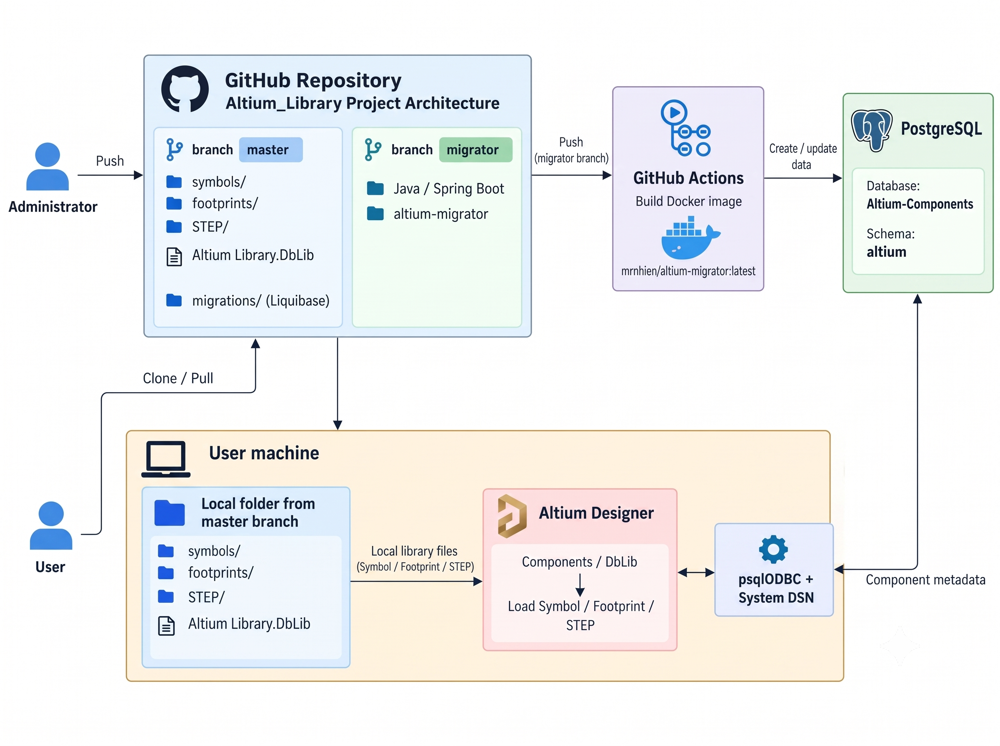
</p>

### How to Use

#### Clone Repository

```bash
git clone https://github.com/NguyenHien-8/Altium_Library.git
```

### Configure PostgreSQL ODBC Driver

#### Offline Development Configuration
1. Download and install PostgreSQL for local development [here](https://www.enterprisedb.com/downloads/postgres-postgresql-downloads) -> Click `Download the installer`.
   - Download and install the PgAdmin management tool from [here](https://www.pgadmin.org/).
   - Create an empty database:
     <p align="center">
       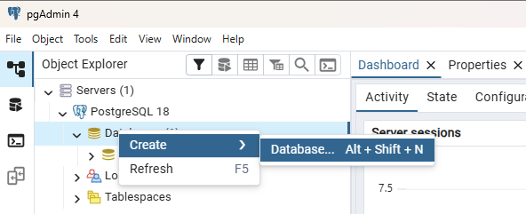
     </p>
   - In the `Database` name field, enter: `Altium-Components` -> Click `Save`.
     <p align="center">
       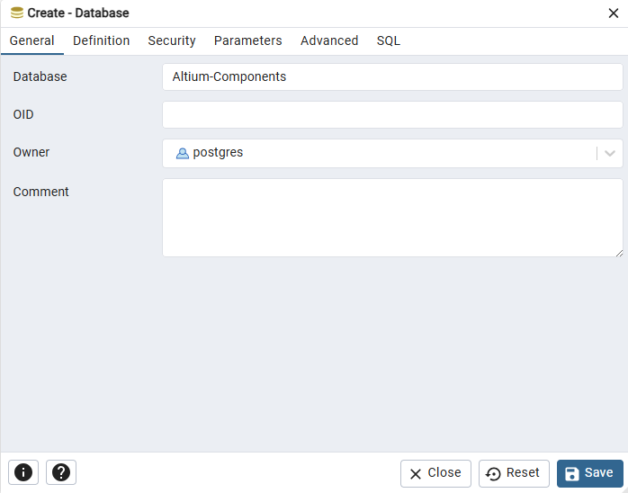
     </p>
2. Download the `psqlODBC_x64` driver from [this archive](https://www.postgresql.org/ftp/odbc/versions.old/).
   We are configuring the ODBC driver for Windows 64-bit (Windows 11 or later), so download the MSI installer. Click on the `msi` directory.
     <p align="center">
       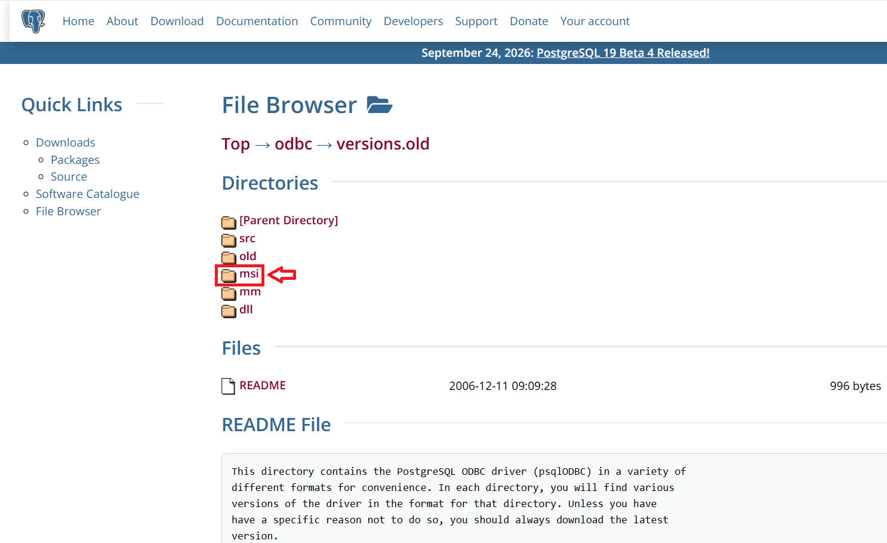
     </p>
3. In the MSI directory, view the available driver versions. The files are compressed in ZIP format.
   Download the latest release, for example `psqlodbc_13_02_0000-x86-1.zip` (or the x64 release).
     <p align="center">
       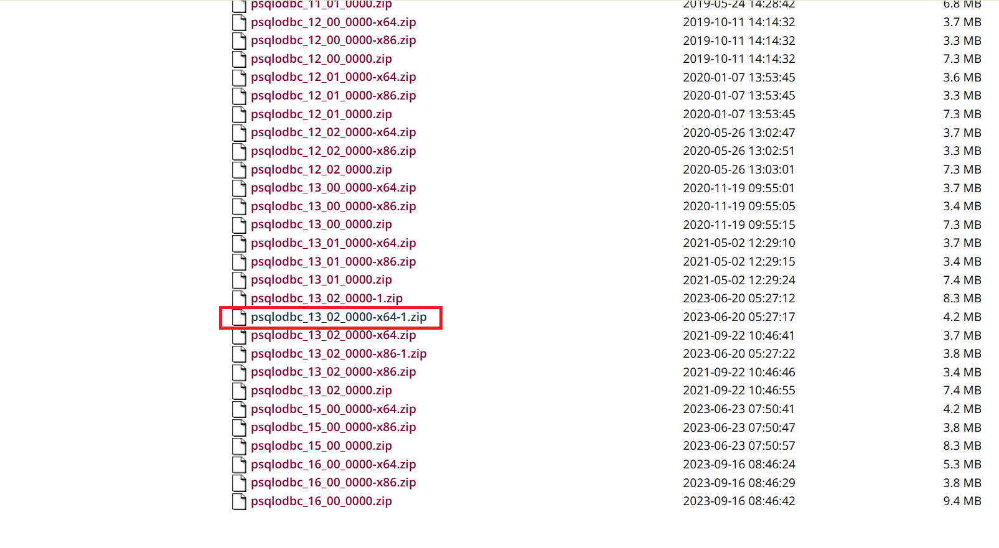
     </p>
4. Once downloaded, right-click the zip file and extract it.
     <p align="center">
       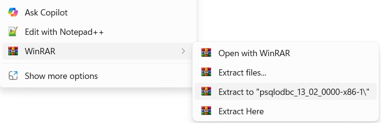
     </p>
5. Run the installer and click `Next`.
     <p align="center">
       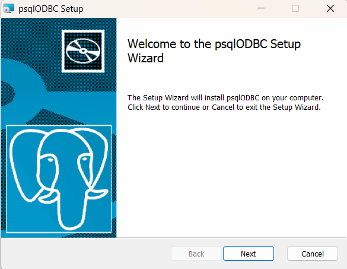
     </p>
6. Accept the license terms by checking "I accept the terms in the license agreement".
7. On the ***Custom Setup*** screen, select your desired driver features and click `Next`.
8. On the ***Ready to install*** screen, click `Install`.

#### Configure pSQLODBC Driver Using System DSN
1. Press the `Windows` key and type `ODBC`.
     <p align="center">
       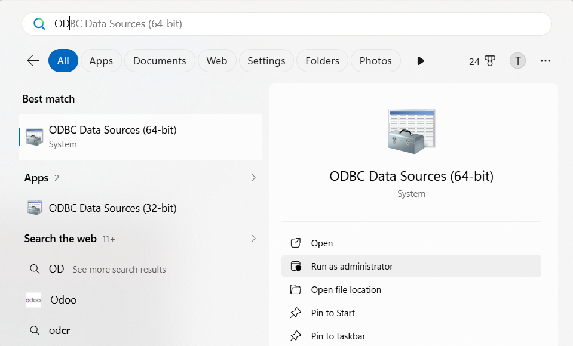
     </p>
2. Open **ODBC Data Sources (64-bit)** -> Click the **System DSN** tab -> Click **Add...**.
     <p align="center">
       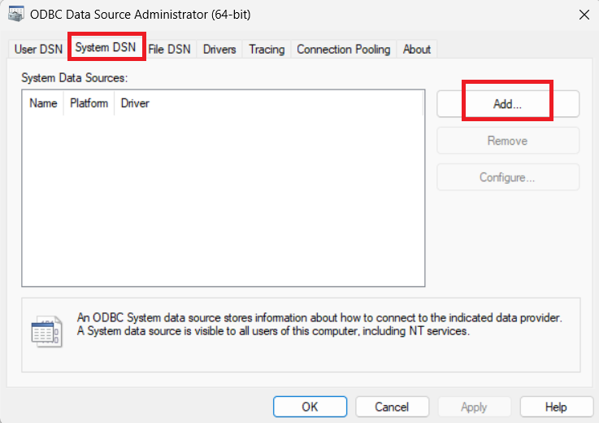
     </p>
3. In the "Create New Data Source" dialog, select **PostgreSQL ODBC Driver(UNICODE)** and click **Finish**.
     <p align="center">
       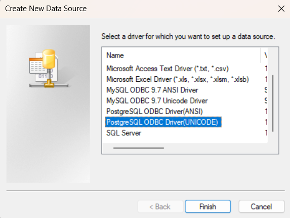
     </p>
4. Configure the parameters as shown below and click `Test`:
     <p align="center">
       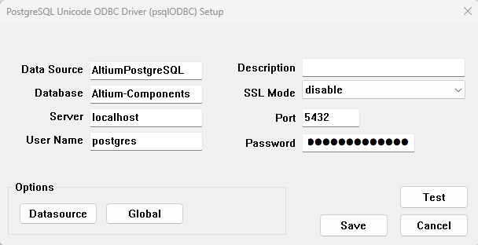
     </p>
5. Confirm successful connection:
     <p align="center">
       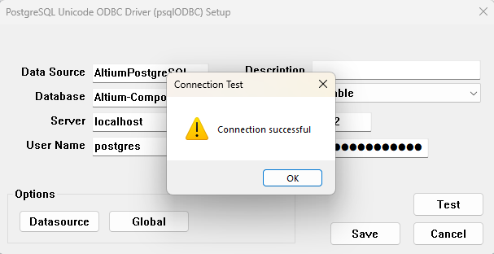
     </p>
6. Click **Save** to create the System DSN. You will see `localPostgres` listed under System DSN.
     <p align="center">
       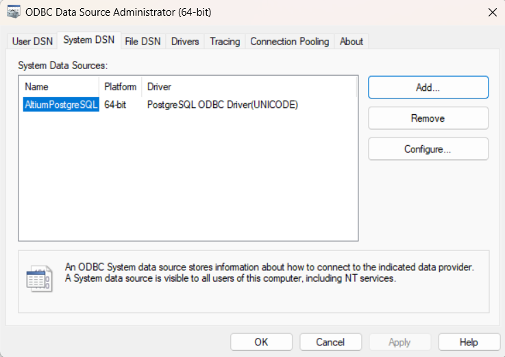
     </p>

#### Populate Data into Database Using Migration Tool
1. Go to [altium-migrator](https://github.com/NguyenHien-8/Altium_Library/tree/migrator#Cách-thức-hoạt-động) and follow the instructions.
2. Once completed, proceed to the next step.

#### Add Library to Altium Designer
1. Open `Altium Designer` -> `Components` -> `File-based Libraries Preferences` -> Click `Install`.
2. Browse to the repository directory and select `Altium Library.DbLib`:
     <p align="center">
       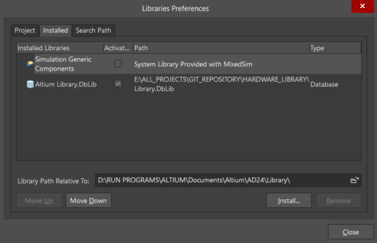
     </p>
3. Check and verify connection settings by clicking the `Advanced...` button:
     <p align="center">
       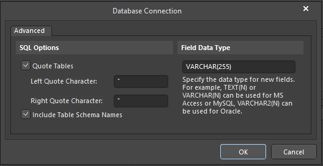
     </p>

### For an Existing Database
1. Skip the first step of local DB installation in the `Offline Development Configuration` guide.
2. In the `Configure pSQLODBC Driver Using System DSN` step, input your existing database host, port, credentials, and database name.
3. Populate/migrate data using [altium-migrator](https://github.com/NguyenHien-8/Altium_Library/tree/migrator).
4. If needed, open `Altium Library.DbLib` with a text editor (such as Notepad) and modify the `ConnectionString` on line 4 with your custom database parameters.

### Project Architecture

```
NguyenHien-8/Altium_Library
│
├── branch migrator
│   └── Java/Spring Boot migrator
│          ↓ GitHub Actions
│   mrnhien/altium-migrator:latest
│
└── branch master
    └── migrations/
          ↓
       Liquibase
          ↓
PostgreSQL: Altium-Components
          ↓
      schema altium
```

<p align="right"><a href="#altium-library">⬆ Back to Top / Lên đầu trang</a></p>

---

<a id="tiếng-việt"></a>
## Tiếng Việt

### Ưu điểm

- **Quản lý linh kiện tập trung:** Thông tin linh kiện được lưu trong PostgreSQL, bao gồm Part Number, mô tả, nhà sản xuất, thông số kỹ thuật, liên kết nhà cung cấp và các tham chiếu đến Symbol/Footprint.
- **Tích hợp trực tiếp với Altium Designer:** Altium truy cập cơ sở dữ liệu thông qua file `.DbLib`, trình điều khiển `psqlODBC` và `System DSN`, giúp tìm kiếm và đặt linh kiện ngay trong bảng `Components`.
- **Tách dữ liệu và thư viện rõ ràng:** PostgreSQL quản lý metadata của linh kiện, trong khi repository lưu các thư viện `SchLib`, `PcbLib` và model 3D `STEP`. Cách tổ chức này giúp dễ quản lý, sao lưu và mở rộng thư viện.
- **Đồng bộ Symbol, Footprint và model 3D:** Mỗi linh kiện trong database tham chiếu đến Symbol, Footprint và STEP tương ứng, giúp hạn chế chọn nhầm package hoặc 3D model khi thiết kế PCB.
- **Dễ cập nhật và mở rộng:** Dữ liệu có thể được bổ sung/cập nhật bằng công cụ migration mà không cần tạo lại toàn bộ thư viện từ đầu.
- **Phù hợp cho làm việc nhóm và nhiều máy trạm:** Khi PostgreSQL được đặt trên máy chủ dùng chung, nhiều máy Altium có thể dùng chung một nguồn dữ liệu sau khi cấu hình DSN và đường dẫn thư viện thống nhất.

### Cách thức hoạt động

Thư viện sử dụng mô hình **Database Library (DbLib)** của Altium Designer. Luồng hoạt động chính như sau:

1. **PostgreSQL** lưu metadata của linh kiện như Part Number, Description, Manufacturer, thông số kỹ thuật, `Library Ref`, `Library Path`, `Footprint Ref` và `Footprint Path`.
2. **psqlODBC** tạo cầu nối giữa Windows và PostgreSQL. Một `System DSN` (ví dụ: `localPostgres`) chứa thông tin kết nối đến database.
3. File **`Altium Library.DbLib`** sử dụng DSN để kết nối Altium Designer với PostgreSQL.
4. Khi người dùng tìm/chọn một linh kiện trong Altium, `.DbLib` truy vấn database để lấy thông tin linh kiện và các tham chiếu đến thư viện.
5. Altium nạp **Symbol** từ thư mục `symbols`, **Footprint** từ thư mục `footprints`; model 3D **STEP** được liên kết với Footprint tương ứng để hiển thị mô hình 3D của linh kiện.
6. Công cụ **`altium-migrator`** được dùng để tạo hoặc cập nhật dữ liệu PostgreSQL từ bộ thư viện, giúp database và các file thư viện duy trì cùng cấu trúc tham chiếu.

Luồng kết nối ngắn gọn:

`PostgreSQL → psqlODBC / System DSN → .DbLib → Altium Designer → Symbol / Footprint / STEP`

<p align="center">
  
</p>

### Cách sử dụng

#### Clone repository

```bash
git clone https://github.com/NguyenHien-8/Altium_Library.git
```

### Cấu hình trình điều khiển ODBC cho PostgreSQL

#### Cấu hình phát triển offline (Offline development configuration)
1. Tải xuống và cài đặt PostgreSQL để phát triển cục bộ [tại đây](https://www.enterprisedb.com/downloads/postgres-postgresql-downloads) -> Chọn `Download the installer`.
   - Tải xuống và cài đặt công cụ PgAdmin từ [đây](https://www.pgadmin.org/).
   - Tạo cơ sở dữ liệu trống:
     <p align="center">
       
     </p>
   - Trong ô `Database`, nhập tên: `Altium-Components` -> Nhấn `Save`.
     <p align="center">
       
     </p>
2. Tải xuống trình điều khiển psqlODBC_x64 từ [kho lưu trữ này](https://www.postgresql.org/ftp/odbc/versions.old/).
   Khi cấu hình trình điều khiển ODBC cho Windows 64-bit (Windows 11 trở lên), chúng ta tải xuống tệp MSI của trình điều khiển. Nhấp vào thư mục `msi`.
     <p align="center">
       
     </p>
3. Trong thư mục MSI, bạn có thể xem các phiên bản trình điều khiển khác nhau (được nén ở định dạng zip).
   Cuộn xuống cuối trang và tải xuống tệp mới nhất, ví dụ `psqlodbc_13_02_0000-x86-1.zip` (hoặc bản phát hành x64 tương ứng).
     <p align="center">
       
     </p>
4. Sau khi tải xuống hoàn tất, nhấp chuột phải vào tệp zip và chọn giải nén (Extract).
     <p align="center">
       
     </p>
5. Cài đặt trình điều khiển psqlODBC. Nhấp vào `Next`.
     <p align="center">
       
     </p>
6. Sau đó tích chọn "I accept the terms in the license agreement".
7. Trên màn hình ***Custom Setup***, chọn các tính năng cần thiết của trình điều khiển và nhấp `Next`.
8. Trên màn hình ***Ready to install***, nhấp vào `Install`.

#### Cấu hình trình điều khiển psqlODBC sử dụng System DSN
1. Nhấn phím `Windows` và gõ `ODBC`.
     <p align="center">
       
     </p>
2. Mở **ODBC Data Sources (64-bit)** -> Nhấp vào thẻ **System DSN** -> Nhấp vào **Add...**.
     <p align="center">
       
     </p>
3. Hộp thoại "Create New Data Source" mở ra, chọn trình điều khiển **PostgreSQL ODBC Driver(UNICODE)** và nhấp vào nút **Finish**.
     <p align="center">
       
     </p>
4. Cấu hình các thông số như hình bên dưới và nhấn `Test`:
     <p align="center">
       
     </p>
5. Kiểm tra thông báo kết nối thành công:
     <p align="center">
       
     </p>
6. Nhấp vào **Save** để tạo System DSN. Quay lại màn hình System DSN, bạn sẽ thấy `localPostgres` DSN đã được tạo thành công.
     <p align="center">
       
     </p>

#### Nạp dữ liệu vào cơ sở dữ liệu bằng công cụ migration
1. Truy cập [altium-migrator](https://github.com/NguyenHien-8/Altium_Library/tree/migrator#Cách-thức-hoạt-động) và thực hiện theo hướng dẫn.
2. Sau khi hoàn tất thành công, tiếp tục với bước bên dưới.

#### Thêm thư viện vào Altium Designer
1. Mở `Altium Designer` -> `Components` -> `File-based Libraries Preferences` -> Nhấp `Install`.
2. Đi đến thư mục repository và chọn file `Altium Library.DbLib`:
     <p align="center">
       
     </p>
3. Ngoài ra, bạn có thể kiểm tra cài đặt kết nối bằng cách nhấn nút `Advanced...`:
     <p align="center">
       
     </p>

### Đối với cơ sở dữ liệu đã tồn tại
1. Bỏ qua bước tạo database cục bộ trong phần hướng dẫn `Cấu hình phát triển offline (Offline development configuration)`.
2. Trong phần `Cấu hình trình điều khiển psqlODBC sử dụng System DSN`, thiết lập các giá trị nguồn dữ liệu theo cơ sở dữ liệu có sẵn của bạn (host, port, username, password và database name).
3. Nạp/đồng bộ dữ liệu vào cơ sở dữ liệu bằng công cụ [altium-migrator](https://github.com/NguyenHien-8/Altium_Library/tree/migrator).
4. Nếu cần, mở file `Altium Library.DbLib` bằng trình soạn thảo văn bản (như Notepad) và tùy chỉnh dòng thứ 4 `ConnectionString` theo các tham số database của bạn.

### Kiến trúc dự án

```
NguyenHien-8/Altium_Library
│
├── branch migrator
│   └── Java/Spring Boot migrator
│          ↓ GitHub Actions
│   mrnhien/altium-migrator:latest
│
└── branch master
    └── migrations/
          ↓
       Liquibase
          ↓
PostgreSQL: Altium-Components
          ↓
      schema altium
```

<p align="right"><a href="#altium-library">⬆ Back to Top / Lên đầu trang</a></p>
